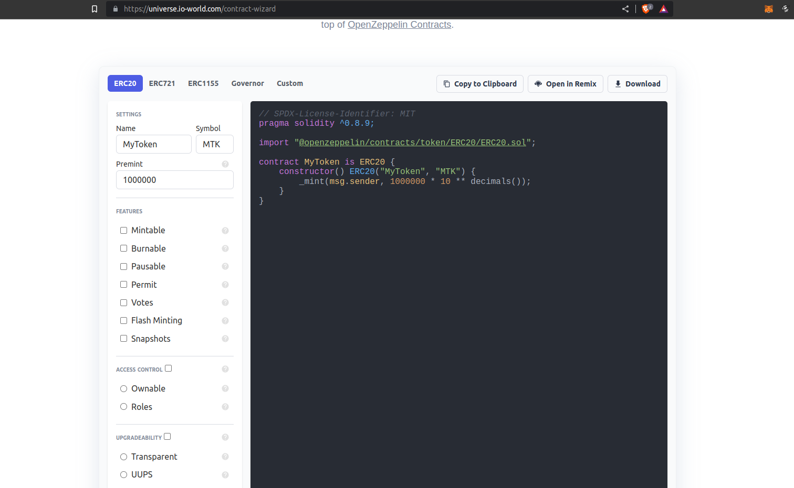

# Deploy ERC-20 in edeXa

### Deploy an ERC20 token to edeXa

How to deploy a token contract that use the ERC20 token standard to edeXa without writing code.

***

### Getting Started[​](broken-reference) 

In this tutorial, we will go over how to deploy an ERC20 token contract. The process is very similar for deploying other tokens as well.

1. Install [Metamask](https://metamask.io/).
2. Add the edeXa network to Metamask. We suggest adding the edeXa testnet to Metamask as well, so you can test contract deployments before deploying to mainnet.
3. Add a small amount of EDX to your Metamask account. In this example, we will deploy to the edeXa testnet, so we need EDX, which you can get from the faucet [here](https://faucet.edexa.com/).
4. Go to the [Open Zeppelin Contracts Wizard](https://docs.openzeppelin.com/contracts/4.x/wizard).
5. Select `ERC20` as the type of contract that you would like to deploy.
6.

    <figure><figcaption></figcaption></figure>
7. Name your token. We are calling our token “ProsperityToken” in this example.
8. Select the features for your token. We are making ProsperityToken mintable, burnable and enabling snapshots, so the token may be used for governance. We are also making the contract Ownable, so the deployer of the contract can mint new tokens and distribute them as desired. Ideally, the owner account will be a multi-signature contract, so no single person has control over this token contract. If you want the block explorer to recognize your token then leave "Upgradeability" unchecked and do not select one of the two radio options below it. Selecting one of these options will prevent the [edeXa block explorer](https://explorer.testnet.edexa.com/) from recognizing your deployed contract as a token. If you want upgradability and do not care about the block explorer, feel free to make your token contract upgradable.

8. Open your contract in Remix by clicking “Open in Remix”. Remix will pop open with the contract code already filled in.
9. Click the big blue button that says “Compile contract-xxxxx.sol”. The contract should compile without error.

10. Click the Ethereum logo in the left sidebar. This will bring up a new interface for deploying the contract.

11. In the “Environment” section on the top left, select “Injected Web3”. This will connect Remix to Metamask. Now clicking the “deploy” button will deploy the contracts to whichever network Metamask is connected to. You should see a small textbox indicating that Remix is connected to a custom network. The edeXa network id is 1995.

.png>)

11. In the Contract dropdown, select the contract that you want to deploy. In this example, it is called ProsperityToken.

13. Click Deploy. Metamask should pop open.

<figure><figcaption></figcaption></figure>

14. click Confirm. Once the transaction confirms (less than 5 seconds), a contract interface will appear in the bottom left, and transaction details will appear in the console at the bottom.

That’s it! We now have ProsperityToken deployed on edeXa with the Metamask account as the contract owner.

You can see the contract information on the [edeXa explorer](https://explorer.testnet.edexa.com/). Copy and paste the contract address or deployment transaction hash from the console output and paste it into the block explorer search bar or look up the deployment transaction info in the Metamask activity.

### Deploying your token on the Mainnet[​](broken-reference) 

When you're ready to deploy your token to the edeXa Mainnet make sure to change the network of your connected wallet from edeXa to the edeXa Mainnet. Once you have done this you can simply redeploy the contract (you will not need to recompile it).

Note: When deploying to the Mainnet you will need to use real EDX to pay the gas fee (as opposed to using the faucet on the testnet). As of December 2021 this cost is less than $0.01 US.

You can read about how to add your new token to the EDX Wallet here.

### Verify[​](broken-reference) 

If you are unable to view your token on the block explorer, you may need to Verify it first. If you are able to see your token, you may skip this section.

Verifying your contract with Remix is straight-forward and allows anyone to read and interact with the contract on the block explorer. You can read more about verifying a contract with Remix on this page.

You can find my example contract [here](https://explorer.testnet.edexa.com/address/0x0Cb52a2528B6A47d22De0DCbAd8017965E07c00B).

Let me know what you end up building and reach out to [discord](https://discord.gg/Pa523yUk) if needed any help
