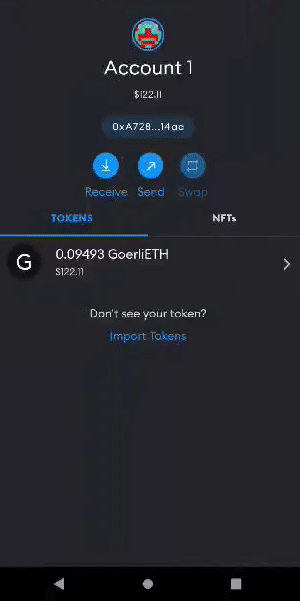

# Part 3 : HOW TO VIEW YOUR NFT IN YOUR WALLET

ERC-721 Solidity

Beginner

This tutorial is Part 3/3 in the NFT Tutorial series, where we view our newly minted NFT. However, you can use the general tutorial for any ERC-721 token using MetaMask, including on Mainnet or any testnet. If you’d like to learn how to mint your own NFT on edeXa, you should check out Part 1 on How to Write & Deploy an NFT smart contract!

Congrats! You’ve made it to the shortest and simplest part of our NFT tutorial series — how to view your freshly minted NFT on a virtual wallet. We’ll be using MetaMask for this example since it is what we used in the previous two parts.

As a prerequisite, you should already have MetaMask on mobile installed, and it should include the account to which you minted your NFT — you can get the app for free on [iOS(opens in a new tab)](https://apps.apple.com/us/app/metamask-blockchain-wallet/id1438144202) or [Android(opens in a new tab)](https://play.google.com/store/apps/details?id=io.metamask\&hl=en\_US\&gl=US).

### Step 1: Set your network to edeXa testnet

At the top of the app, press the “Wallet” button, after which you’ll be prompted to select a network. As our NFT was minted on the edeXa test network, you’ll want to select edeXa testnet as your network.

Once you’re on the edeXa network, select the “Collectibles” tab on the right and add the NFT smart contract address and the ERC-721 token ID of your NFT — which you should be able to find on [edeXascan](https://explorer.testnet.edexa.com/) based on the transaction hash from your NFT deployed in Part II of our tutorial.

<figure><figcaption></figcaption></figure>

You may need to refresh a couple times to view your NFT — but it will be there !

Congrats! You have successfully minted an NFT, and you can now view it! We can’t wait to see how you’ll take the NFT world by storm!

#### Was this page helpful?
